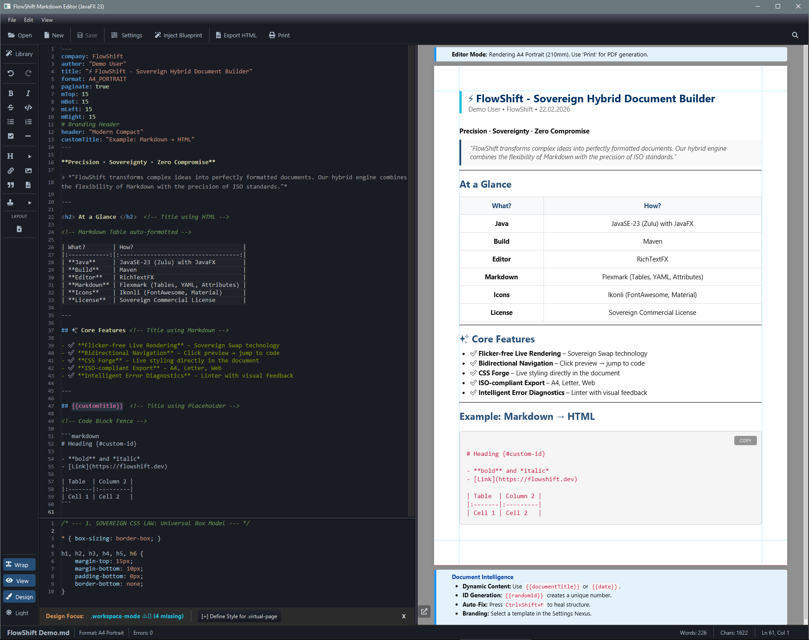

# FlowShift - Sovereign Hybrid Document Engine

    

        <strong>⚡ Precision · Sovereignty · Zero Compromise ⚡</strong>
    

    

        
        
        
        
    

 

    <a href="https://henrykdz.github.io/Sovereign-Hybrid-Document-Processor-Editor/">🌐 Live Demo</a> •
    <a href="#introduction">🚀 Introduction</a> •
    <a href="#target-audience">🎯 Target Audience</a> •
    <a href="#philosophy">🧠 Philosophy</a> •
    <a href="#features">✨ Features</a> •
    <a href="#architecture">🏗️ Architecture</a>
     
    <a href="#preview">🖼️ Preview</a> •
    <a href="#background">📖 Background</a> •
    <a href="#availability">🔧 Availability</a> •
    <a href="#license">📄 License</a> •
    <a href="#contact">💬 Contact</a>

<h2 style="color: #00d1ff; border-bottom: 1px solid #30363d; padding-bottom: 5px;">🚀 Introduction</h2>

The **FlowShift Sovereign Document Engine** is a high-performance **Hybrid Document Builder**. It transcends the limits of traditional editors by seamlessly unifying **Markdown**, **HTML5/CSS3**, and **YAML** into a single, cohesive workflow.

Developed by architect **Henryk Daniel Zschuppan**, this engine is built for professionals who demand absolute control over content, form, and the physical geometry of their documents.

> *"FlowShift transforms complex ideas into perfectly formatted documents. Our hybrid engine combines the flexibility of Markdown, HTML/CSS, and YAML with the precision of ISO standards."*

---

## 🎯 Target Audience

<table>
  <tr>
    <td width="250">📋 <strong>Protocol Officers</strong></td>
    <td width="250">🔬 <strong>Scientists &amp; Researchers</strong></td>
  </tr>
  <tr>
    <td width="250">🏭 <strong>Industry &amp; Manufacturing</strong></td>
    <td width="250">🏢 <strong>Enterprises &amp; Corporations</strong></td>
  </tr>
  <tr>
    <td width="250">⚖️ <strong>Legal Professionals</strong></td>
    <td width="250">🏥 <strong>Medical &amp; Healthcare</strong></td>
  </tr>
  <tr>
    <td width="250">🏦 <strong>Finance &amp; Insurance</strong></td>
    <td width="250">📝 <strong>Technical Writers</strong></td>
  </tr>
</table>

---

<h2 style="color: #00d1ff; border-bottom: 1px solid #30363d; padding-bottom: 5px;">🧠 Core Philosophy</h2>

| Principle | Description |
|-----------|-------------|
| **Sovereignty** | Full user control over data, design, and workflow. The document is law, not the application. |
| **Efficiency** | Maximum performance with minimal resource consumption. No unnecessary waiting, no bloat. |
| **Precision** | Pixel‑perfect WYSIWYG rendering, consistent across all output media. |

---

<h2 style="color: #00d1ff; border-bottom: 1px solid #30363d; padding-bottom: 5px;" id="features">✨ Key Features</h2>

### Unrivalled Editing Experience

| Feature | Description |
|---------|-------------|
| **Flicker‑free live rendering** | Real-time preview updates via `Sovereign Swap` mechanism |
| **Scroll invariance** | Stable focus position in preview while typing |
| **Bidirectional navigation** | Click in preview jumps to corresponding Markdown source |
| **Intelligent error diagnostics** | Visual linter feedback in status bar |

### Layout & Design Sovereignty

| Feature | Description |
|---------|-------------|
| **CSS Forge** | Live styling directly in the document flow |
| **Precise pagination** | Exact conversion to physical pages (A4, Letter) |
| **Neutral start** | No enforced formatting – defined explicitly in YAML |

### Complete Feature List

✅ **Formatter** – Automatic formatting of Markdown, HTML and CSS  
✅ **Linter** – Real-time error detection with visual feedback  
✅ **Syntax Highlighter** – Color-highlighted code for better readability  
✅ **Custom Placeholders** – For templates and mail merges  
✅ **ISO-compliant Export** – A4, Letter, Web – everything possible

---

<h2 style="color: #00d1ff; border-bottom: 1px solid #30363d; padding-bottom: 5px;" id="architecture">🏗️ Technical Architecture</h2>

### High-Level Overview

- **JavaFX Desktop Application** – Native performance with modern UI
- **Hybrid Rendering Engine** – Markdown → HTML → WebView with zero flicker
- **Real-time Source Mapping** – Character-accurate bidirectional navigation
- **Modular Design** – Clean separation of concerns

<b>🔧 Complete Technology Stack</b> · [ Developer Details ▼ ]

 

| Component | Technology |
|-----------|------------|
| **Java Version** | JavaSE-23 (Zulu 23) with bundled JavaFX |
| **Build Tool** | Apache Maven |
| **UI Framework** | JavaFX 23 (WebKit, Controls, FXML) |
| **Markdown Processing** | Flexmark-Java v0.64.8 (with extensions: tables, GFM strikethrough, tasklists, YAML front matter, attributes, anchor links) |
| **Rich Text Editor** | RichTextFX v0.11.7 |
| **Icons** | Ikonli v12.4.0 (FontAwesome5, Material, MaterialDesign) |
| **JSON Processing** | Jackson Databind v2.18.2, Gson v2.11.0 |
| **HTML Parsing** | Jsoup v1.18.3 |
| **SVG Support** | fxsvgimage v1.1 |
| **Testing** | JUnit 5, Mockito |

### The Sovereign Bridge

The `SovereignSourceMapper` injects a unique `data-fsid` into every HTML element, linking each element to the exact character offset in the source text for precise bidirectional navigation.

### Navigation & Anchor Logic

- **Fully automatic:** Headings automatically receive unique IDs for tables of contents
- **Sovereign override:** Use `{#custom-id}` after a heading to override automation
- **HTML integrity:** Pure HTML tags remain untouched

---

## 🖼️ Preview

---

<h2 style="color: #00d1ff; border-bottom: 1px solid #30363d; padding-bottom: 5px;" id="background">📖 The Story Behind FlowShift</h2>

This software was born from personal necessity. For over 26 years, the architect fought against an undiagnosed spinal condition (C1/C2). When his body couldn't, his mind did. Code became distraction, therapy, and finally passion.

**FlowShift** is the result – a tool that creates order when life becomes chaotic. It is a conscious counter-design to the bloated software industry: **lean, precise, and sovereign**.

> *I've nothing left to prove – only something left to build.*

### About the Architect

The vision behind FlowShift comes from a place of deep personal experience. The architect's goal is software without "bloat", defined by **precision and efficiency**. The engine was designed using AI-assisted development methods, guaranteeing exceptional code purity and consistent architecture.

### The Future of Documentation

FlowShift is the foundation for **interactive documents**, **AI orchestration**, and **data‑sovereign content** – a local alternative to cloud systems.

---

## 🔧 Availability & Early Access

**FlowShift is a commercial product in active development.**  
The source code is private and not publicly available.

 

**📊 Status:** 🔧 Private Development · Preview Q3 2026  
**👥 Early Access:** By request · Limited spots  
**📧 Contact:** [h.zschuppan@aol.com](mailto:h.zschuppan@aol.com?subject=Early%20Access%20FlowShift)  
**🌐 Website:** [https://flowshift.dev](https://henrykdz.github.io/Sovereign-Hybrid-Document-Processor-Editor/)

 

*Enterprise licenses and evaluation versions available upon request.*

---

## 📄 License

**Sovereign Commercial License**

Copyright © {2025-PRESENT} FlowShift (Henryk Daniel Zschuppan). All rights reserved.

This software is a commercial product. No part may be reproduced without written permission.

*— Our commitment: Perpetual and unconditional rights for licensees. —*

---

<h2 id="contact">💬 Contact</h2>

- **Architect:** Henryk Daniel Zschuppan
- **Email:** [h.zschuppan@aol.com](mailto:h.zschuppan@aol.com)
- **GitHub:** [@henrykdz](https://github.com/henrykdz)
- **Timezone:** Europe/Berlin

---

    ⚡ Precision · Sovereignty · Zero Compromise ⚡
     
    © 2026 FlowShift · Early Access Build

