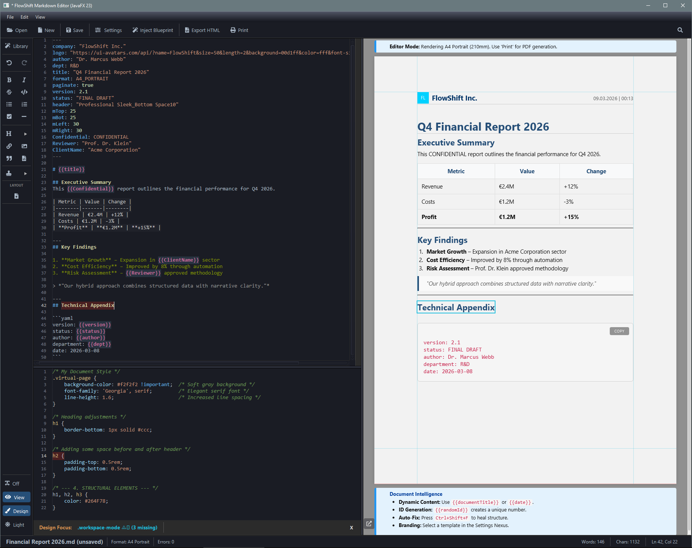

# FlowShift - Hybrid Document & Web Forge

    

        
        
        
        
    

 

<table style="border:none; background:transparent; border-collapse:collapse;">
  <tr>
    <td width="250" style="border:none;"><a href="https://henrykdz.github.io/Sovereign-Hybrid-Document-Processor-Editor/">🌐 Website</a></td>
    <td width="250" style="border:none;"><a href="#introduction" style="color:#00d1ff; text-decoration:none;">🚀 <strong>Introduction</strong></a></td>
    <td width="250" style="border:none;"><a href="#target-audience" style="color:#00d1ff; text-decoration:none;">🎯 <strong>Target Audience</strong></a></td>
  </tr>
  <tr>
    <td width="250" style="border:none;"><a href="#philosophy" style="color:#00d1ff; text-decoration:none;">🧠 <strong>Philosophy</strong></a></td>
    <td width="250" style="border:none;"><a href="#features" style="color:#00d1ff; text-decoration:none;">✨ <strong>Features</strong></a></td>
    <td width="250" style="border:none;"><a href="#architecture" style="color:#00d1ff; text-decoration:none;">🏗️ <strong>Architecture</strong></a></td>
  </tr>
  <tr>
    <td width="250" style="border:none;"><a href="#formats" style="color:#00d1ff; text-decoration:none;">📄 <strong>Formats</strong></a></td>
    <td width="250" style="border:none;"><a href="#preview" style="color:#00d1ff; text-decoration:none;">🖼️ <strong>Preview</strong></a></td>
    <td width="250" style="border:none;"><a href="#background" style="color:#00d1ff; text-decoration:none;">📖 <strong>Background</strong></a></td>
  </tr>
  <tr>
    <td width="250" style="border:none;"><a href="#availability" style="color:#00d1ff; text-decoration:none;">🔧 <strong>Availability</strong></a></td>
    <td width="250" style="border:none;"><a href="#license" style="color:#00d1ff; text-decoration:none;">📄 <strong>License</strong></a></td>
    <td width="250" style="border:none;"><a href="#contact" style="color:#00d1ff; text-decoration:none;">💬 <strong>Contact</strong></a></td>
  </tr>
</table>

---

<h2 id="introduction" style="color: #00d1ff; border-bottom: 1px solid #30363d; padding-bottom: 5px;">🚀 Introduction</h2>

The **FlowShift Sovereign Document Engine** unifies **Markdown**, **HTML/CSS**, and **YAML** into a single, cohesive workflow.

 

> *"Built for architects of information, professionals who demand absolute control over content, form, and geometry, FlowShift's Document Forge enables complex ideas to become perfectly formatted documents with the precision of ISO standards."*

---

<h2 id="target-audience" style="color: #00d1ff; border-bottom: 1px solid #30363d; padding-bottom: 5px;">🎯 Target Audience</h2>

<table style="white-space: nowrap;">
  <tr>
    <td style="padding-right: 30px;">📋 <strong>Protocol Officers</strong></td>
    <td style="padding-right: 30px;">🔬 <strong>Scientists & Researchers</strong></td>
    <td>🏭 <strong>Industry & Manufacturing</strong></td>
  </tr>
  <tr>
    <td style="padding-right: 30px;">🏢 <strong>Enterprises & Corporations</strong></td>
    <td style="padding-right: 30px;">⚖️ <strong>Legal Professionals</strong></td>
    <td>🏥 <strong>Medical & Healthcare</strong></td>
  </tr>
  <tr>
    <td style="padding-right: 30px;">🏦 <strong>Finance & Insurance</strong></td>
    <td style="padding-right: 30px;">📝 <strong>Technical Writers</strong></td>
    <td>📚 <strong>Publishers & Editors</strong></td>
  </tr>
  <tr>
    <td style="padding-right: 30px;">🏛️ <strong>Government & Public Sector</strong></td>
    <td style="padding-right: 30px;">🎓 <strong>Academics & Educators</strong></td>
    <td>⚙️ <strong>Engineering & R&D</strong></td>
  </tr>
</table>

---

<h2 id="use-cases" style="color: #00d1ff; border-bottom: 1px solid #30363d; padding-bottom: 5px;">📋 What You Can Create</h2>

From technical documentation to creative projects – FlowShift handles it all:

<table style="width: auto; min-width: 100%; white-space: nowrap;">
  <tr>
    <td style="padding-right: 40px;"><strong>📄 Technical manuals & protocols</strong></td>
    <td><strong>🔧 Machine inspection reports</strong></td>
  </tr>
  <tr>
    <td style="padding-right: 40px;"><strong>⚙️ Machine instructions & guides</strong></td>
    <td><strong>🏦 Loan confirmations & financial docs</strong></td>
  </tr>
  <tr>
    <td style="padding-right: 40px;"><strong>📊 Reports & whitepapers</strong></td>
    <td><strong>✅ Task lists & project documentation</strong></td>
  </tr>
  <tr>
    <td style="padding-right: 40px;"><strong>📝 Meeting minutes & protocols</strong></td>
    <td><strong>💳 Business cards</strong></td>
  </tr>
  <tr>
    <td style="padding-right: 40px;"><strong>🩺 Medical referral forms</strong></td>
    <td><strong>📚 eBooks & documentation portals</strong></td>
  </tr>
  <tr>
    <td style="padding-right: 40px;"><strong>🌐 Simple, well-formatted websites</strong></td>
    <td><strong>🎓 Tutorials & learning materials</strong></td>
  </tr>
</table>

---

<h2 id="philosophy" style="color: #00d1ff; border-bottom: 1px solid #30363d; padding-bottom: 5px;">🧠 Core Philosophy</h2>

| Principle | Description |
|-----------|-------------|
| **Sovereignty** | Full user control over data, design, and workflow. The document is law, not the application. |
| **Efficiency** | Maximum performance with minimal resource consumption. No unnecessary waiting, no bloat. |
| **Precision** | Pixel‑perfect WYSIWYG rendering, consistent across all output media. |

---

<h2 id="features" style="color: #00d1ff; border-bottom: 1px solid #30363d; padding-bottom: 5px;">✨ Key Features</h2>

### Unrivalled Editing Experience

| Feature | Description |
|---------|-------------|
| **Flicker‑free live rendering** | Real-time preview updates via `Sovereign Swap` (zero flicker, stable scroll) |
| **Source mapping navigation** | Click any element in preview – jumps to and selects the exact source line |
| **Intelligent error diagnostics** | Visual linter feedback in status bar |

### Layout & Design Sovereignty

| Feature | Description |
|---------|-------------|
| **CSS Forge** | Live styling directly in the document flow |
| **Precise pagination** | Exact conversion to physical pages (A4, Letter) |
| **Neutral start** | No enforced formatting – defined explicitly in YAML |

### Complete Feature List

✅ **Formatter** – Automatic formatting of Markdown, HTML and CSS  
✅ **Linter** – Real-time error detection with visual feedback  
✅ **Syntax Highlighter** – Color-highlighted code for better readability  
✅ **Custom Placeholders** – For templates and mail merges  
✅ **ISO-compliant Export** – A4, Letter, Web – everything possible

---

<h2 id="formats" style="color: #00d1ff; border-bottom: 1px solid #30363d; padding-bottom: 5px;">📄 Supported Document Formats</h2>

### ISO/DIN A-Series (International)
| Format | Dimensions | Use Case |
|--------|------------|----------|
| **A0** | 841 × 1189 mm | Posters, technical drawings |
| **A1** | 594 × 841 mm | Posters, flip charts |
| **A2** | 420 × 594 mm | Presentations, newspapers |
| **A3** | 297 × 420 mm | Magazines, diagrams |
| **A4 Portrait** | 210 × 297 mm | Letters, reports, forms |
| **A4 Landscape** | 297 × 210 mm | Wide format presentations |
| **A5 Portrait** | 148 × 210 mm | Brochures, notepads |
| **A5 Landscape** | 210 × 148 mm | Folded brochures |
| **A6** | 105 × 148 mm | Postcards, flyers |

<b>📌 US/ANSI Standards (North America)</b> [click to expand]

 

| Format | Dimensions | Use Case |
|--------|------------|----------|
| **Letter** | 215.9 × 279.4 mm | Business correspondence |
| **Legal** | 215.9 × 355.6 mm | Legal documents, contracts |
| **Tabloid** | 279.4 × 431.8 mm | Newspapers, ledgers |
| **Executive** | 184.15 × 266.7 mm | Government documents |

<b>🎴 Special Formats</b> [click to expand]

 

| Format | Dimensions | Use Case |
|--------|------------|----------|
| **Business Card (EU)** | 85 × 55 mm | European standard cards |
| **Business Card (US)** | 89 × 51 mm | US standard cards |
| **Credit Card (ID-1)** | 85.6 × 53.98 mm | Payment cards, IDs |

<b>🌐 Web & Screen Formats</b> [click to expand]

 

| Format | Dimensions | Use Case |
|--------|------------|----------|
| **Web Wide** | 100% width | Responsive web content |
| **Web Reading** | 800px width | Optimized reading view |
| **Social Square** | 200 × 200 mm | Social media graphics |

---

<h2 id="architecture" style="color: #00d1ff; border-bottom: 1px solid #30363d; padding-bottom: 5px;">🏗️ Technical Architecture</h2>

### High-Level Overview

- **JavaFX Desktop Application** – Native performance with modern UI
- **Hybrid Rendering Engine** – Markdown → HTML → WebView with zero flicker
- **Real-time Source Mapping** – Click in preview, edit in source
- **Modular Design** – Clean separation of concerns

<b>🔧 Complete Technology Stack</b> · [ Developer Details ▼ ]

 

| Component | Technology |
|-----------|------------|
| **Java Version** | JavaSE-23 (Zulu 23) with bundled JavaFX |
| **Build Tool** | Apache Maven |
| **UI Framework** | JavaFX 23 (WebKit, Controls, FXML) |
| **Markdown Processing** | Flexmark-Java v0.64.8 (with extensions: tables, GFM strikethrough, tasklists, YAML front matter, attributes, anchor links) |
| **Rich Text Editor** | RichTextFX v0.11.7 |
| **Icons** | Ikonli v12.4.0 (FontAwesome5, Material, MaterialDesign) |
| **JSON Processing** | Jackson Databind v2.18.2, Gson v2.11.0 |
| **HTML Parsing** | Jsoup v1.18.3 |
| **SVG Support** | fxsvgimage v1.1 |
| **Testing** | JUnit 5, Mockito |

### The Sovereign Bridge

The `SovereignSourceMapper` injects a unique `data-fsid` into every HTML element, linking each element to the exact character offset in the source text – click any element to jump to its source line.

### Navigation & Anchor Logic

- **Fully automatic:** Headings automatically receive unique IDs for tables of contents
- **Sovereign override:** Use `{#custom-id}` after a heading to override automation
- **HTML integrity:** Pure HTML tags remain untouched

---

<h2 id="preview" style="color: #00d1ff; border-bottom: 1px solid #30363d; padding-bottom: 5px;">🖼️ Preview</h2>

### 🎨 Document Design with open CSS Forge

*In this example, hovering over "Technical Appendix" triggers a blue highlight. Clicking jumps directly to the corresponding line in the editor – automatically selected and ready to edit.*

---

<h2 id="background" style="color: #00d1ff; border-bottom: 1px solid #30363d; padding-bottom: 5px;">📖 The Story Behind FlowShift</h2>

This software was born from personal necessity. For over 26 years, the architect fought against an undiagnosed spinal condition (C1/C2). When his body couldn't, his mind did. Code became distraction, therapy, and finally passion.

**FlowShift** is the result – a tool that creates order when life becomes chaotic. It is a conscious counter-design to the bloated software industry: **lean, precise, and sovereign**.

> *I've nothing left to prove – only something left to build.*

### About the Architect

The vision behind FlowShift comes from a place of deep personal experience. The architect's goal is software without "bloat", defined by **precision and efficiency**. The engine was designed using AI-assisted development methods, guaranteeing exceptional code purity and consistent architecture.

### The Future of Documentation

FlowShift is the foundation for **interactive documents**, **AI orchestration**, and **data‑sovereign content** – a local alternative to cloud systems.

---

<h2 id="availability" style="color: #00d1ff; border-bottom: 1px solid #30363d; padding-bottom: 5px;">🔧 Availability & Early Access</h2>

**FlowShift is a commercial product in active development.**  
The source code is private and not publicly available.

 

**📊 Status:** Private Development · Preview Q3 2026  
**👥 Early Access:** By request · Limited spots  
**🌐 Website:** [https://flowshift.dev](https://henrykdz.github.io/Sovereign-Hybrid-Document-Processor-Editor/)

 

*For inquiries: [h.zschuppan@aol.com](mailto:h.zschuppan@aol.com?subject=FlowShift%20Inquiry)*  
*Enterprise licenses and evaluation versions available upon request.*

---

<h2 id="license" style="color: #00d1ff; border-bottom: 1px solid #30363d; padding-bottom: 5px;">📄 License</h2>

**Sovereign Commercial License**

Copyright © {2025-PRESENT} FlowShift (Henryk Daniel Zschuppan). All rights reserved.

This software is a commercial product. No part may be reproduced without written permission.

*— Our commitment: Perpetual and unconditional rights for licensees. —*

---

<h2 id="contact" style="color: #00d1ff; border-bottom: 1px solid #30363d; padding-bottom: 5px;">💬 Contact</h2>

- **Architect:** Henryk Daniel Zschuppan
- **GitHub:** [@henrykdz](https://github.com/henrykdz)
- **Timezone:** Europe/Berlin

*All inquiries via [h.zschuppan@aol.com](mailto:h.zschuppan@aol.com)*

---

    ⚡ Precision · Sovereignty · Zero Compromise ⚡
     
    © 2026 FlowShift · Early Access Build

